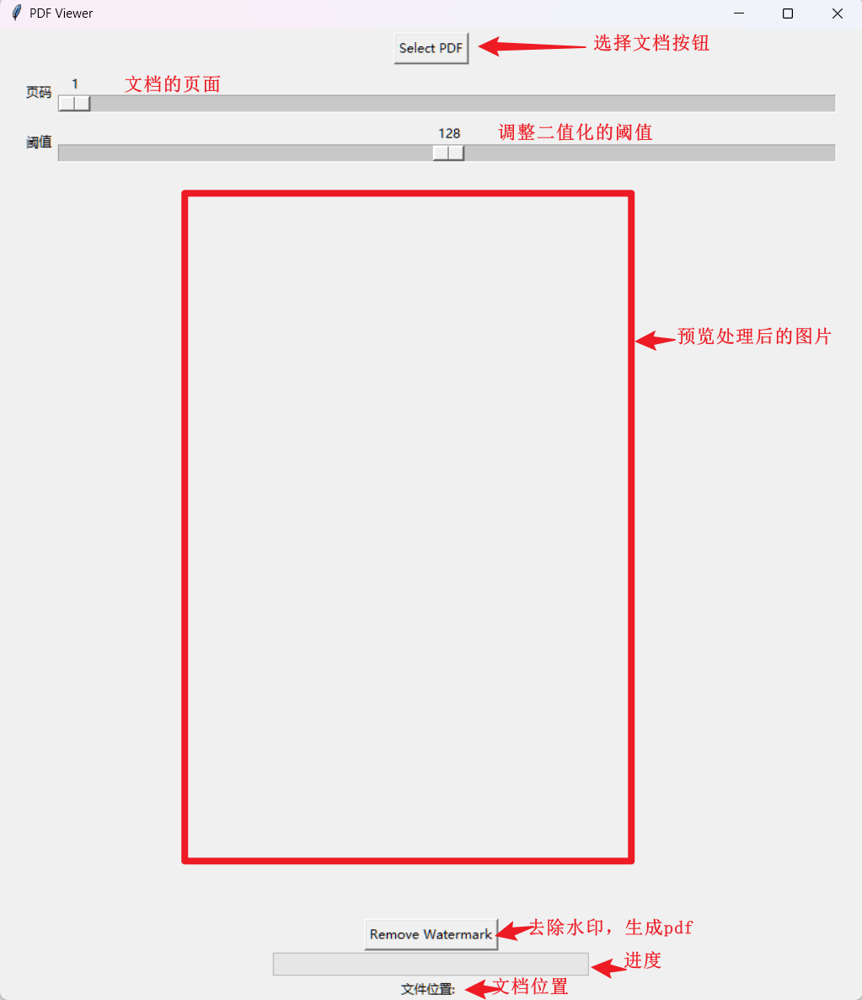
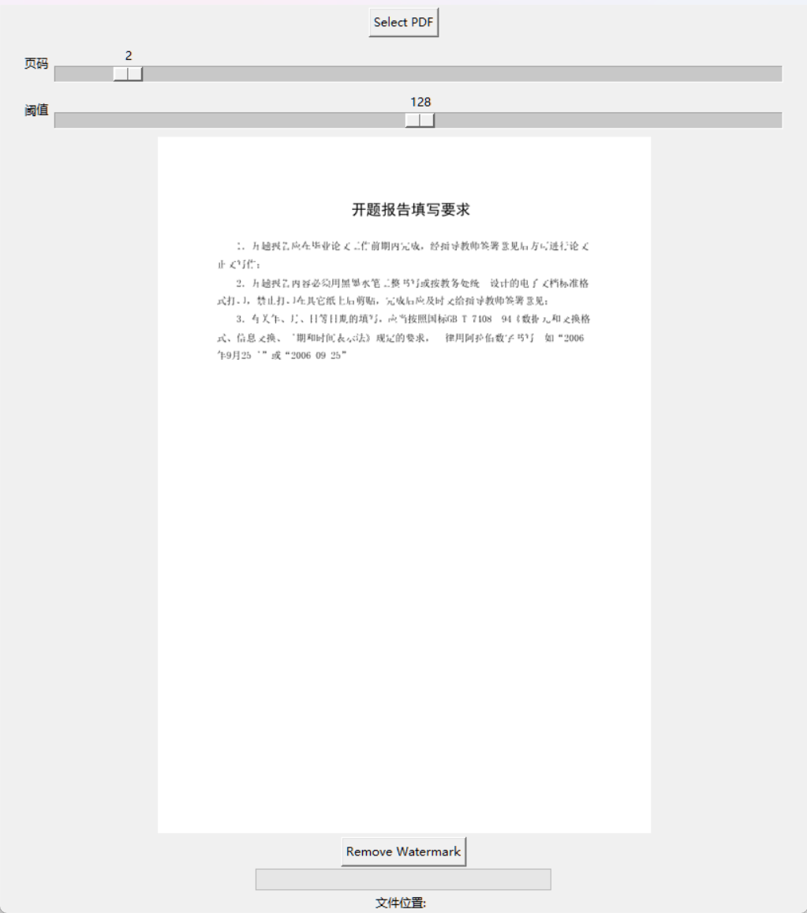

# watermark-remove
使用简单的图形化页面进行阈值的设置，然后根据阈值进行水印的去除

## 使用介绍

1. 使用select按钮进行文件的选择
2. 调整页码滑块，查看显示的页码
3. 调整阈值滑块，预览处理后的图像（此图像便是处理后的效果）
4. 点击remove watermark 根据阈值进行生成处理后的pdf

==注意：仅对由图片生成的pdf，且为灰色的水印，效果较好==

# 界面

## 初始界面

## 选择文件后界面

## 去除效果

### 由图片组成的pdf

{待定，图片读取好像有点问题}

### 标准的pdf

